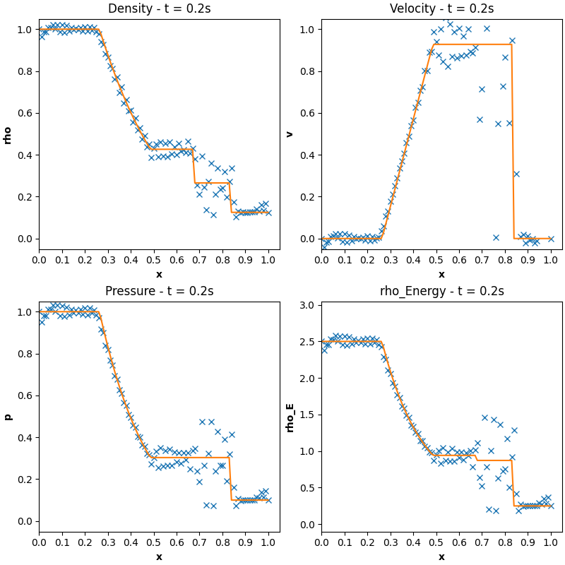
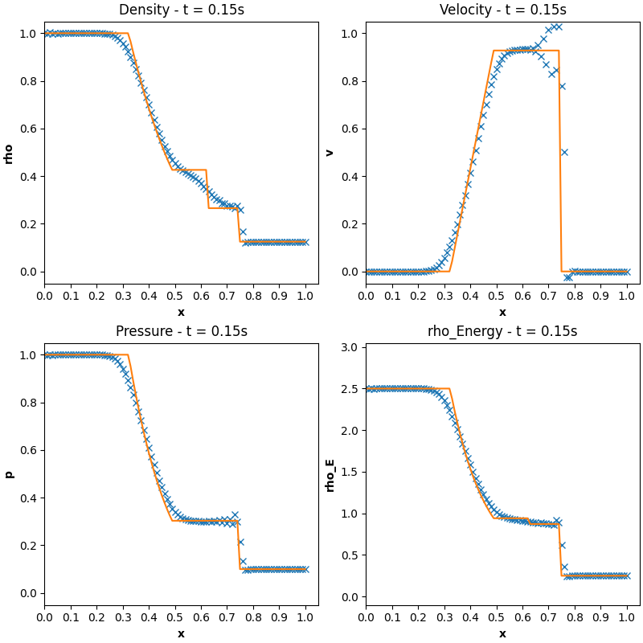
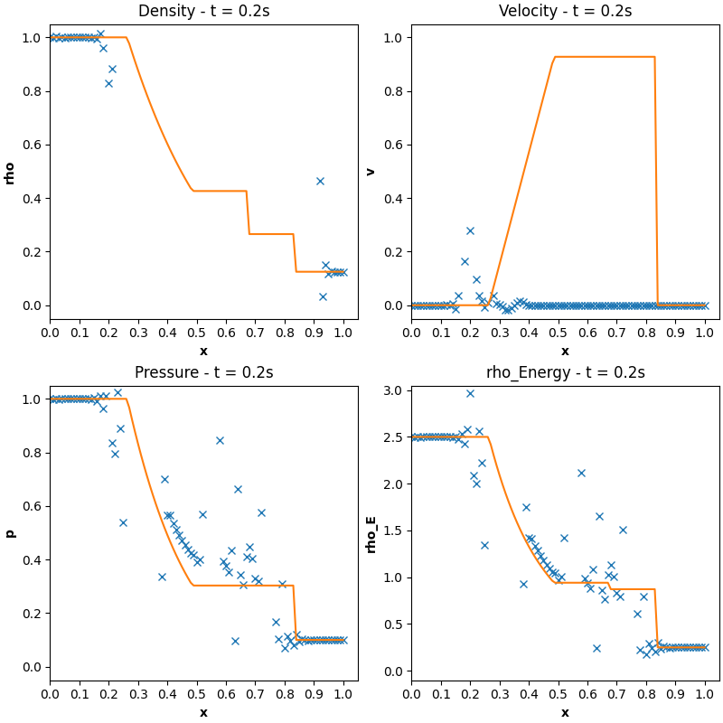
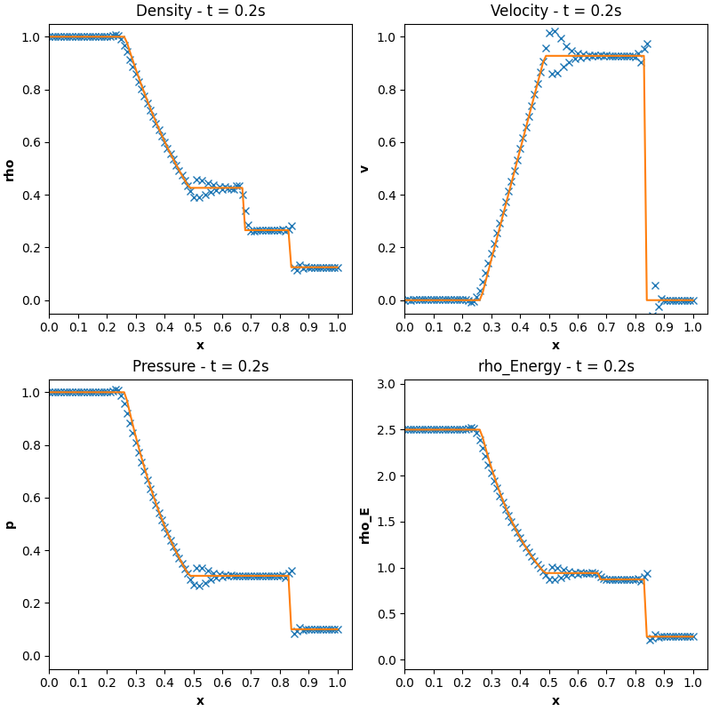
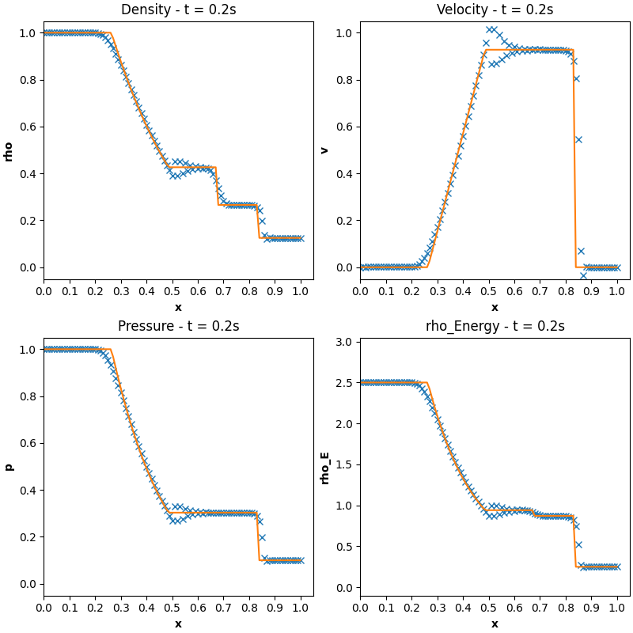

# 1D Finite Element Method (FEM) Solver - Euler Equations - 1D Sod Shock Tube Problem

## Description
This project employs a one-dimensional Finite Element Method (FEM) solver in Python. It uses the Galerkin method with 1D Lagrange basis functions and 2nd order Gaussian Quadrature for numerical integration. The solver is capable of solving the 1D Euler equations using Classical Runge Kutta 4 with Standard Galerkin, Taylor Galerkin 2nd order One Step, Taylor Galerkin 2nd order Two Step and Classic Runge Kutta 4 with Taylor Galerkin 2nd order Two Step at each intermediate timestep. The problem being solved is the classical 1D Sod Shock Tube Problem.

This code has been part of my work at the Barcelona Supercomputing Centre (BSC) and aims to be useful for people starting their CFD journey using FEM solvers.

## Features
- **Solver Methods**: 
- **Basis Functions**: Uses 1D Lagrange basis functions for spatial discretization.
- **Gaussian Quadrature**: Employs 2nd Order Gaussian Quadrature for numerical integration.
- **User Interaction**: Allows user input for end of simulation timestep and numerical scheme choice.

## Requirements
- Python 3.x
- NumPy
- Matplotlib
- os
- Scipy

## Usage
To run the solver, execute 'main.py' script in a Python environment and follow the terminal prompts. See below for sample usage.

```
python main.py
```

You will then see the following:

```
>>> Input the last timestep (s) -----> 0.2

>>> Please choose your numerical scheme. 
 1. RK4 with Standard Galerkin 
 2. Taylor Galerkin (TG2) One-Step 
 3. Taylor Galerkin (TG2) Two-Step 
 4. RK4 with Taylor Galerkin Two-Step 

Type your choice here -----> 1

```

## Output
The program computes and plots the numerical solution of the Euler Equations given initial and boundary conditions explained below.

# Background
## Compressible Flow
In this section the finite element numberical solution of the Euler in one dimension is presented. First we will look into the background and lay out the mathematics.

## Navier Stokes equations
Let $d$ be the space dimension (1, 2, 3). From the conservation of principles of momentum, mass and energy result the Navier-Stokes equations, which can be written as:

$$
\frac{\partial \phi}{\partial t} + \frac{\partial F_i (\phi)}{\partial x_i} = 0 \tag{1}
$$

for $i=1, ..., d$. As given by $(1)$ the set of unknowns given by $\phi$ is:

$$
\phi = \left[ \begin{array}{c}
      U_1 \\
      U_2 \\
      U_3 \\
      \rho E
\end{array} \right] \tag{2}
$$

where $\boldsymbol{U} = (U_1, U_2, U_3)$ is the momentum, $\rho$ is the density and $E$ is the total energy per unit volume, all of them being functions of space $\boldsymbol{x} = (x_1, x_2, x_3)$ and time $t$. The flux $\boldsymbol{F}$ for convection and diffusion in each dimension is given by:

$$
\mathbf{F^{conv,1}} = 
\left [\begin{array}{cc}
\frac{U_1 U_1}{\rho} + p\\
\frac{U_2 U_1}{\rho}\\
\frac{U_3 U_1}{\rho} \\
U_1 \\
\frac{U_1}{\rho} (E + p)
\end{array} \right ],
\quad
\mathbf{F^{conv,2}} = 
\left [\begin{array}{cc}
\frac{U_1 U_2}{\rho}\\
\frac{U_2 U_2}{\rho} + p\\
\frac{U_3 U_2}{\rho} \\
U_2 \\
\frac{U_2}{\rho} (E + p)
\end{array} \right ],
\quad
\mathbf{F^{conv,3}} = 
\left [\begin{array}{cc}
\frac{U_1 U_3}{\rho}\\
\frac{U_2 U_3}{\rho}\\
\frac{U_3 U_3}{\rho}+p \\
U_3 \\
\frac{U_3}{\rho} (E + p)
\end{array} \right ], \tag{3}
$$

$$
\mathbf{F^{diff,1}} = 
\left [\begin{array}{cc}
\tau_{11}\\
\tau_{21}\\
\tau_{31}\\
0 \\
\frac{U_k \tau_{k1}}{\rho} - q_1
\end{array} \right ],
\quad
\mathbf{F^{diff,2}} = 
\left [\begin{array}{cc}
\tau_{12}\\
\tau_{22}\\
\tau_{32}\\
0 \\
\frac{U_k \tau_{k2}}{\rho} - q_2
\end{array} \right ],
\quad
\mathbf{F^{diff,3}} = 
\left [\begin{array}{cc}
\tau_{13}\\
\tau_{23}\\
\tau_{33}\\
0 \\
\frac{U_k \tau_{k3}}{\rho} - q_3
\end{array} \right ], \tag{4}
$$

For the purposes of these calculations, the definitions of $\tau_{ij}$ will not be shown as we will be dealing with the Euler equations that effectively mean $\mu = 0$ disccused in the following section. 

## Euler Equations
As discussed briefly, the Euler equations are the inviscid equations of compressible flow. They are a particular case of the Navier-Stokes $(1)$. Therefore we can take the three-dimensional Euler equations as:

$$
\frac{\partial \phi}{\partial t} + A_i(\phi) \frac{\partial \phi}{\partial x_i} = 0, \tag{5}
$$

where $i = 1, ...., 3$ labels the space dimension and $\mathbf{\phi}$ is the vector of the unknowns in $(2)$. 

# Problem Statement

## 1D Formulation - Euler Equations
The 1D formulation of $(5)$ which is also the focus of this code, can also be written as:

$$
U_t + F(U)_x = 0, \tag{6}
$$


Where:

$$
U = \left [\begin{array}{cc}
\rho \\
m \\
\rho E
\end{array} \right ]
$$

And: 

$$
F(U) = \left [\begin{array}{cc}
m\\
\frac{m^2}{\rho} + p \\
\frac{m(\rho E + p)}{\rho}
\end{array} \right ]
$$

Taking note that: $\rho$ is density, $m = \rho v$ i.e momentum and $\rho E$ is the total energy per unit volume.

We take the assumption of a perfect gas in this problem there the pressure, $p$ is given by:

$$
p = (\gamma - 1) \left(\rho E - \frac{m^2}{2\rho}\right) \tag{7}
$$

Where $\gamma = \frac{C_p}{C_v} = 1.4$ 

The initial conditions are taken as those of a Sod Shock Tube:

$$
(\rho, v, p)_{t=0}=\begin{cases}
(1.0, 0, 1.0) & \text{if } 0 < x \leq 0.5 \\
(0.125, 0.0, 0.1) & \text{if } 0.5 < x < 1
\end{cases}
$$

And Dirichlet Boundary conditions (i.e., the conserved quantities take on the values specified by the initial conditions at either boundary). 

## Numerical Methods Employed
### 1. Classic Runge Kutta 4 with Standard Galerkin
- Start by weakening the form and integrating over the domain:

$$
\int_{\Omega} W U_t\, dx + \int_{\Omega} W F(U)_x\, dx = 0
$$

- Integrate by parts to reduce the derivative on $F(U)_x$:

$$
\int_{0}^{L} W U_t \, dx + - \int_{0}^{L} W_x F(U) \, dx = 0
$$

- Discretizing over the internal nodes:

$$
w = \sum N_A (x)
$$

$$
U_A = \sum N_B (x) U(t)
$$

- This leads to:

$$
\int_{\Omega} \sum_{B=2}^{n_{eq+1}} N_A N_B \frac{dU_A}{dt}\, dx -  \int_{\Omega} \sum_{B=2}^{n_{eq+1}} \frac{\partial N_A}{\partial x} F_{gp}\, dx = 0  
$$

- With the matrices given as:

$$
M = \int_{0}^L \sum N_A N_B\, dx 
$$

$$
F = \int_0^L \sum \frac{\partial N_A}{\partial x} F_{gp}\, dx 
$$

-  To get $F_{gp}$ (The Flux at the gaussian, aka integration points) we need to extract the values of $U$ for each $\rho,  m, \rho E$ at the gaussian point, and then perform the necessary calculations as given for $F(U)$ using these values.

$$
\rho_{gp} = \sum N \rho_{el}
$$

$$
m_{gp} = \sum N m_{el}
$$

$$
\rho E_{gp} = \sum N \rho E_{el}
$$

$$
F_{gp} = \left [\begin{array}{cc}
m_{gp}\\
\frac{m_{gp}^2}{\rho_{gp}} + p_{gp} \\
\frac{m(\rho_{gp} E_{gp} + p_{gp})}{\rho_{gp}}
\end{array} \right ]
$$

- With this we can setup up our RK4 formulation similar to burgers to solve the system of equations:

$$
M \frac{du}{dt} = F
$$

- Solving with 100 elements and a timestep $dt = 1.5 * 10^{-3}$, the snapshot at time $t=0.2s$ of $\rho$, $v$, $p$ and $\rho E$ with the classic RK4 with Standard Galerkin is plotted below:

<div>

</div>

<br>

- $\textit{Blue crosses}$ is our numerical solution and $\textit{orange line}$ is the analytic solution. As you can see a reasonable amount of oscillations can be seen, something that will be looked into further in the next methods.

### 2. Taylor Galerkin (TG2) One-Step
- Time integration is performed by means of a one-step second order scheme:

$$
\frac{U^{n+1} - U^n}{\Delta t} = U_t^n + \frac{\Delta t}{2} U_{tt}^n
$$

- Where:

$$
U_t = - F_x
$$

$$
U_{tt} = - F_{xt} = -F_{tx} = - (AU_t)_x = (AF_x)_x = (A^2 U_x)_x
$$

- $A$ is taken as the Jacobian matrix $A = \frac{\partial F}{\partial U}$:

$$ 
A = \left [
\begin{array}{ccc}
\frac{\partial m}{\partial \rho} & \frac{\partial m}{\partial m} & \frac{\partial m}{\partial \rho E} \\
\frac{\partial \left( \frac{m^2}{\rho} + p \right)}{\partial \rho} & \frac{\partial \left(\frac{m^2}{\rho} + p\right)}{\partial m} & \frac{\partial\left(\frac{m^2}{\rho} + p\right)}{\partial \rho E} \\
\frac{\partial \left(\frac{m\rho E + p}{\rho}\right)}{\partial \rho} & \frac{\partial \left(\frac{m\rho E + p}{\rho}\right)}{\partial m} & \frac{\partial\left(\frac{m\rho E + p}{\rho}\right)}{\partial \rho E}
\end{array} \right ]
$$

- After integration by parts of the spatial terms the associated variational form is. The boundary condition is cancelled:

$$
\int^L_0 W \cdot \frac{U^{n+1} - U^n}{\Delta t} dx = \int^L_0 W_x \cdot F^n dx - \frac{\Delta t}{2} \int^L_0 W_x \cdot (A^n)^2 U_x^n dx - \cancel{\left[W \cdot \left( F^n + \frac{\Delta t}{2} F_t^n\right) \right]^{x=L}_{x=0}}
$$

$$
\int^L_0 W \cdot \frac{U^{n+1} - U^n}{\Delta t} dx = \int^L_0 W_x \cdot F^n dx - \frac{\Delta t}{2} \int^L_0 W_x \cdot (A^n)^2 U_x^n dx
$$

- Again discretizing over the internal nodes with the following: 

$$
W = \sum N_A (x)
$$

$$
U_A = \sum N_B (x) U(t)
$$

- This leads to:

$$
\int_0^L \sum N_A N_B \cdot \frac{dU}{dt} dx = \int_0^L \sum \frac{\partial N_A}{\partial x} \cdot F^n dx - \frac{\Delta t}{2} \int_0^L \sum \frac{\partial N_A}{\partial x} \cdot (A^n)^2 \frac{\partial N_B}{\partial x} U^n dx
$$

- Where:

$$
M = \int_0^L \sum N_A N_B dx
$$

$$
F = \int_0^L \sum \frac{\partial N_A}{\partial x} \cdot F^n dx
$$

$$
K = - \frac{\Delta t}{2} \int_0^L \sum \frac{\partial N_A}{\partial x} \cdot (A^n)^2 \frac{\partial N_B}{\partial x} dx
$$

- And the system of equations to be solved is:

$$
M \frac{dU}{dt} = F + KU^n
$$

$$
M \left(\frac{U^{n+1}- U^n}{\Delta t}\right) = F + KU^n
$$

$$
M(U^{n+1}) = \Delta t (F + KU^n) + MU^n
$$

- Similar to before, the flux term $F^n$ is calculated at the gaussian (integration) points and follows the same idea as the previous method:

$$
\rho_{gp} = \sum N \rho_{el}
$$

$$
m_{gp} = \sum N m_{el}
$$

$$
\rho E_{gp} = \sum N \rho E_{el}
$$

$$
F_{gp} = \left [\begin{array}{cc}
m_{gp}\\
\frac{m_{gp}^2}{\rho_{gp}} + p_{gp} \\
\frac{m(\rho_{gp} E_{gp} + p_{gp})}{\rho_{gp}}
\end{array} \right ]
$$

- With pressure is calculated as described in $(7)$, we use this in our Jacobian matrix $A$ to get:

$$
A = \left [
\begin{array}{ccc}
0 & 1 & 0 \\
\frac{\gamma - 3}{2} \frac{m^2}{\rho^2} & (3 - \gamma) \frac{m}{\rho} & \gamma - 1 \\
-\gamma \frac{m \rho E}{\rho^2} + (\gamma - 1) \frac{m^3}{\rho^3} & \gamma \frac{\rho E}{\rho} - \frac{3}{2} (\gamma - 1) \frac{m^2}{\rho^2} & \gamma \frac{m}{\rho}
\end{array} \right ]
$$

- At the gaussian point, squaring this for $(A^n)^2$ we get an expression for this as:

$$
(A_{gp})^2 = \left [
\begin{array}{ccc}
0 & 1 & 0 \\
\left(\frac{\gamma - 3}{2} \frac{m_{gp}^2}{\rho_{gp} ^2}\right)^2 & \left((3 - \gamma) \frac{m_gp}{\rho_{gp}}\right)^2 & \left(\gamma - 1\right)^2 \\
\left(-\gamma \frac{m_{gp} \rho E_{gp}}{\rho_{gp}^2} + (\gamma - 1) \frac{m_{gp}^3}{\rho_{gp}^3} \right)^2 & \left(\gamma \frac{\rho E_{gp}}{\rho_{gp}} - \frac{3}{2} (\gamma - 1) \frac{m_{gp}^2}{\rho_{gp}^2} \right)^2 & \left( \gamma \frac{m_{gp}}{\rho_{gp}} \right)^2
\end{array} \right ]
$$

- Therefore, the idea is that the Jacobian matrix is re-calculated for each element for each timestep.

- We will present two sets of results for this numerical method.

- At timestep $t = 0.15s$: 

<div>
    
</div>
<br>

- and at timestep $t = 0.2s$. 

<br>
<div>
    
</div>
<br>

- As you can see in the above figures, the method seems to be working relatively good at a timestep before our target $t = 0.2s$ but seems to be diverging after some time. This will be fixed when we look at the next numerical methods.

### 3. Taylor Galerkin (TG2) Two-Step
- In this method we are solving the Euler Equations by means of a two-step time scheme:

$$
U^{n+1/2} = U^n + \frac{\Delta t}{2}U_t^n = U^n - \frac{\Delta t}{2}\nabla \cdot F^n
$$

$$
U^{n+1} = U^n + \Delta t U_t^{n+1/2} = U^n - \Delta t \nabla \cdot F^{n+1/2}
$$

- The weakened form in the second step is given by: 

$$
\int_{\Omega} W \cdot \frac{U^{n+1}-U^n}{\Delta t}\, dx = \int_{\Omega} \nabla W \cdot F^{n+1/2}\, dx - \cancel{\left[W \cdot F^{n+1/2}\right]_{x=0}^{x=L}}
$$

- Again discretizing over the internal nodes with the following: 

$$
W = \sum N_A (x)
$$

$$
U_A = \sum N_B (x) U(t)
$$

- This leads to:

$$
\int_0^L \sum N_A N_B \cdot \left(\frac{U^{n+1}-U^n}{\Delta t}\right) dx = \int_0^L \sum \frac{\partial N_A}{\partial x} \cdot F^{n+1/2} dx 
$$

- Where:

$$
M = \int_0^L \sum N_A N_B dx
$$

$$
F = \int_0^L \sum \frac{\partial N_A}{\partial x} \cdot F^{n+1/2} dx
$$

- And the system of equations to be solved is:

$$
M U^{n+1} = \Delta t F + M U^n
$$

- Which brings us to the main core challenge of this numerical method which is to calculate $F^{n+1/2}$. 

- An important thing to note is that: 

$$
F^n = F(U^n)
$$

$$
F^{n+1/2} = F(U^{n+1/2})
$$

- As a result the two-step Taylor Galerkin is implemented in two main steps:

- STEP 1: Compute at the gaussian points of the elements the intermediate $U^{n+1/2}$ using:

$$
U^{n+1/2} = U^n - 1/2 \Delta t \nabla \cdot F(U^n)
$$


- Where: 

$$
U^n = U_{gp} = \left[\begin{array}{cc}
\rho_{gp}\\
m_{gp} \\
\rho E_{gp}
\end{array} \right]
$$

- And the Flux calculated using group representation instead of the classical representation used in the above two numerical method (basically calculating flux in element rather than gaussian points and then using shape functions to evaluate flux at gp):

$$
F_{el} = \left[\begin{array}{cc}
m_{el}\\
\frac{m_{el}^2}{\rho_{el}} + p_{el} \\
\frac{m(\rho_{el} E_{el} + p_{el})}{\rho_{el}}
\end{array} \right]
$$

$$
\nabla \cdot F(U^n) = F_{gpx} = \sum Nx \cdot F_{el}
$$

- Therefore once we have the intermediate point $U^{n+1/2}$ the intermediate flux F^{n+1/2} is then easily evaluated within the gaussian point loop

$$
F^{n+1/2} = F(U^{n+1/2})
$$

- Thereafter it is just the case of computing the end of step value of $U^{n+1}$ using the algebraic system of equations discussed.

- At time 0.2s solving using 100 elements and a timestep $\Delta t = 0.2s$ we get:

<br>
<div>
    
</div>
<br>

- As can be seen a more accurate representation is achieved using the Taylor Galerkin (TG2) two step method. This can be further optimized by combining numerical scheme 1 (RK4) with TG2 two step. This will be shown in the next section.

### 4. Runge Kutta 4 with Taylor Galerkin (TG2) Two-Step
- In this numerical scheme we follow a combination of numerical schemes described in point 1. and 3. and we basically solve the system of equations as describe by RK4 method, but instead of solving using the standard flux matrix built using standard Galerkin method, we will use the intermediate flux described in TG2 Two step. For each sub-timestep of RK4 we apply the TG2 Two-Step and thus manage to benefit both from the higher accuracy of RK4 whilst around shocks we benefit from TG2 Two step's ability to better capture shock behaviour. The following graph results after solving with 100 elements and a timestep $\Delta t = 0.2s$:

<br>
<div>
    
</div>
<br>

- As seen, a better shock capturing ability is achieved.
